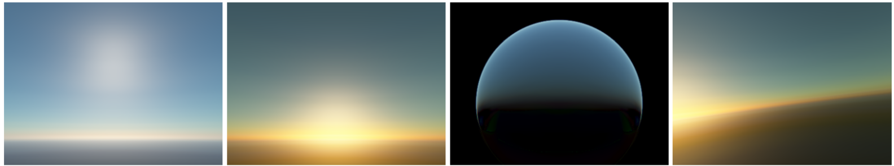
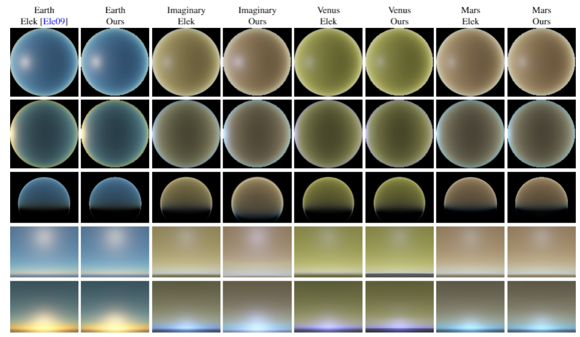

## Multilayer Perceptron Based Sky and Atmosphere Rendering

This folder contains 3 projects which were used to generate results and train neural networks presented in chapter 6 of PhD thesis "_Effective methods of real-time light atmospheric scattering simulation_":
* Atmosphere Framework - which runs the MLP neural network models (NNs) and Elek's model to generate renders as well as comparisons and images' data like luminance, chromaticity, RMSE. This framework is also responsible for creating look-up-tables (using Elek's method) which are then used to train NNs using python scripts.
* Atmosphere Software Renderer - which runs the NNs and Elek's model in an interactive application.
* Python scripts - which are responsible for training the NNs using previously generated look-up-tables, creating dataset for Img Based NNs (based on synthetic fisheye images and Kider's photos) and merging Kider's photos into HDR files.

### Prerequisites

To run Python scripts you'll need the following additional libraries (apart from Python 3.5+):
* numpy
* tensorflow
* matplotlib
* pandas
* Keras
* OpenCV 2
* Pillow
* [imageio](http://imageio.github.io/)
* [PyGLM](https://pypi.org/project/PyGLM/)

You can, for example, install them with ```pip```.

Python scripts also require Kider's photos to generate HDR files and then to generate dataset for Img Based NNs. These images can be downloaded [here](http://web.archive.org/web/20160617214024/http://www.graphics.cornell.edu/resources/clearsky/data/2013-05-27/HDR/). 

After download, unpack all the archives to the separate folders and place them in the directory _python_nn_training/hdr_merge/dataset/_ or adjust the paths in the _python_nn_training/hdr_merge/**hdr_merge_tool.py**_ script.

### How to build

#### Atmosphere Framework
To build main Atmosphere Framework run the following commands in the root folder of the repository:

```
mkdir build
cd build
cmake ..
```

This will create project files inside the build directory. 

**Note**: this project was only tested on _Windows 10_ machine with _Visual Studio 2019_ Community installed.

#### Atmosphere Software Renderer

To build Atmosphere Software Renderer run the following commands in the root folder of the repository:

```
cd AtmosphereSoftwareRenderer
mkdir build
cd build
cmake ..
```

This will create project files inside the build directory. 

**Note**: this project was only tested on _Windows 10_ machine with _Visual Studio 2019_ Community installed.

#### Python scripts

To run Python scripts, first make sure, that libraries listed in the [Prerequisites](#prerequisites) section are available on your machine. Then you can run one of the following scripts:
* _model_training.py_ - this script trains various neural network models (described in the paper). Before using it, make sure that you've generated LUTs using [Atmosphere Framework](#atmosphere-framework) and you've provided proper paths inside the script. This script also allows to translate Keras NN model to a file that could be then loaded into [Atmosphere Framework](#atmosphere-framework) or [Atmosphere Software Renderer](#atmosphere-software-renderer).
* _atmo_rendering.py_ - This script is a variation of [Atmosphere Framework](#atmosphere-framework) which allows to render images for different views and planets using Python with pregenerated NN models using _model_training.py_.
* _hdr_merge/hdr_merge_tool.py_ - is responsible for combining real photographs with different exposures (created by Kider et al.) into one HDR image. Run it before _hdr_merge/create_dataset_from_hdr.py_.
* _hdr_merge/create_dataset_from_hdr.py_ - this script generates dataset for training Img Based NN (with _model_training.py_) based on the HDR images that were created with  _hdr_merge/hdr_merge_tool.py_.

### Final remarks

Note that each project may require you to change some values directly in the code (especially Python scripts) to compute different things. Take your time getting to know the code (it should be self-explanatory, however there are some comments inside the code). If something isn't clear, just contact with me via Github.

All improvements (pull-requests) to the code base are very welcome!

### Examples
The neural networks based approach is capable of not only rendering the Earth's atmosphere but also atmopsheres' of other planets. All in one neural network:


